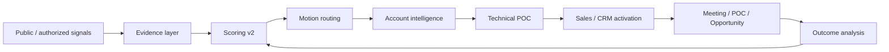

# ⚡ VeloDB Commercial Intelligence OS

**An outside-in commercial intelligence system designed around VeloDB's open-source-to-enterprise motion.**

It turns public technical evidence into **account prioritization, commercial-motion routing, technical POC plans, and a framework for closed-loop revenue learning**—without pretending that technology usage equals buying intent.

> Independent portfolio project by Aditya Chouhan. Not an official VeloDB product, endorsement, customer system, or claim of access to VeloDB internal data.

## 15-second view



The system answers:

1. **Is the workload technically relevant?**
2. **What is observed vs inferred?**
3. **Is there actual evidence of pain, timing, or intent?**
4. **Which VeloDB / Apache Doris motion fits?**
5. **What would a fair POC need to prove?**
6. **What counter-evidence should reduce current sales priority?**
7. **How should outcomes improve future routing?**

## Why this is not a normal lead-scoring demo

A company can be a perfect technical fit and still be a poor near-term sales target.

Scoring v2 separates:

```text
Technical fit      0–40
Pain evidence      0–20
Timing             0–15
Intent             0–15
Evidence quality   0–10
Counter-signals    subtract from priority
```

Example:

```text
Technical fit       38
Pain evidence        0
Timing               0
Intent               8
Evidence quality    10
Counter penalty    -24
──────────────────────
Priority             32
```

Interpretation: **highly relevant workload, low current displacement urgency.**

Confidence is based on source coverage and independent corroboration—not the number of detected signals. Duplicate signals do not increase the score, and unknown signals are surfaced rather than silently rewarded.

### Governed scoring configuration

The model weights live in the packaged policy file:

[`app/scoring/scoring_v2.json`](app/scoring/scoring_v2.json)

That file versions dimension caps, technical/timing/pain weights, commercial-intent weights, and counter-signal penalties. `app/scoring/scoring.py` loads it as package data and emits `scoring_version` with every analysis result, so editable installs and built distributions use the same policy.

Full methodology: [`docs/SCORING_MODEL_V2.md`](docs/SCORING_MODEL_V2.md)

## Current evidence status

| Layer | Status | Honest boundary |
|---|---|---|
| Public observed account universe | **implemented with source URLs** | technical evidence, not buying intent |
| Counter-signals | **implemented** | reduce priority without erasing technical fit |
| Public web collector | **implemented** | page reachability + disclosed keyword presence |
| Weekly source smoke test | **implemented in GitHub Actions** | source health only |
| Competitive/use-case routing | implemented | deterministic hypothesis routing |
| Technical POC planner | implemented | plan generation, not benchmark performance |
| Apache Doris workload harness | **implemented** | reproducible workload; no invented timings |
| Closed-loop outcome model | implemented architecturally | no real VeloDB outcomes claimed |
| Internal VeloDB product/CRM telemetry | **not available / not claimed** | requires authorization |
| Apache Doris upstream contribution | **planned, not claimed** | only after a real upstream need is reproduced |

## Public account research

`data/real_target_accounts.json` contains a small, intentionally inspectable set of publicly documented workloads:

- **Contentsquare** — ClickHouse, Kafka/Flink, near-real-time customer analytics
- **QuestionPro** — ClickHouse + Kafka for real-time BI over billions of rows
- **Razorpay** — Trino with Spark/Hudi/S3/Hive Metastore
- **Rapido** — Trino for large-scale analytics, KPI/system metrics and BI
- **Vimeo** — ClickHouse-based real-time video analytics at high event volume

Each account contains source-backed observed claims, explicit hypotheses, modeled buying roles rather than inferred individuals, counter-signals such as incumbent success or lack of observed pain, a routed technical motion, and a POC blueprint.

None is labeled a buyer, lead, or migration opportunity solely because a technology is present.

```bash
python -m app.main --dataset public
```

## Executive dashboard

The Streamlit UI starts with an executive market view showing priority score, technical fit, pain evidence, timing, intent, evidence quality, counter-signal penalty, and routed commercial motion. The account drill-down then exposes evidence, hypotheses, buying-role model, POC plan, talk track, and evidence gate.

```bash
streamlit run app/dashboard.py
```

## Public-source collector

`app/collectors/public_web.py` retrieves configured public pages and records an auditable receipt:

```text
URL
retrieval timestamp
HTTP status
keyword hits
visible error state
```

A keyword hit means only **the term appeared on the page**. It is never silently promoted into production usage, pain, or intent.

```bash
python scripts/refresh_public_evidence.py --check
```

`.github/workflows/public-signal-smoke.yml` runs this weekly and uploads the receipt as a workflow artifact.

## Commercial motions

| Observed signal | Routed motion | POC should validate |
|---|---|---|
| ClickHouse | competitive / migration evaluation | concurrency, joins, freshness, operations, cost |
| Elasticsearch / OpenSearch | observability/search consolidation | search + analytics, retention economics, fragmentation |
| Loki | large-scale log analytics | search latency, cardinality, storage economics |
| Trino / Hive | lakehouse / serving acceleration | interactive latency, concurrency, serving efficiency |
| AI / RAG / agents | context / agent observability | fresh structured/event analytics and simplification |
| customer-facing analytics | real-time product analytics | P95 latency, peak concurrency, ingestion lag, cost |

Detected technology is **never treated as proof of dissatisfaction**.

## Apache Doris workload harness

`benchmark/doris/` contains a reproducible agent-observability workload:

```text
schema.sql             Doris table design
generate_events.py     deterministic synthetic events
queries.sql            recent-window, trace, error and aggregation queries
run.sh                 Stream Load + query execution
README.md              fair benchmark protocol
```

```bash
bash benchmark/doris/run.sh
```

### Benchmark boundary

No Doris latency or throughput results are claimed yet because the build environment used for this portfolio artifact did not expose a running Doris cluster. The repository provides the harness instead of inventing numbers.

Any future result should disclose software versions, infrastructure, row count, data distribution, concurrency, ingestion state, repeated-run policy, P50/P95/P99, throughput, failures and cost assumptions.

## What changes with internal VeloDB access

With explicit authorization, the same system could add Apache Doris community/account resolution, VeloDB Cloud trial activation and PQL telemetry, repeat-query/data-loaded/multi-user/integration signals, CRM stages and seller actions, partner/co-sell context, technical POC results and blockers, competitive loss reasons, and signal-to-meeting/POC/pipeline/win evaluation.

That is the path from an outside-in system to an **open-source-to-enterprise revenue intelligence layer**.

## Closed-loop learning

The feedback layer models:

```text
no reply → reply → meeting → POC → opportunity → won / lost
```

It does **not** auto-rewrite weights. Production recalibration should require sufficient sample size, holdout/control evaluation, false-positive analysis, model versioning and human approval.

## Repository structure

```text
app/
├── agents/                 strategy + activation
├── collectors/             public evidence retrieval
├── intelligence/           evidence, routing, POC, commercialization, feedback
├── scoring/
│   ├── scoring.py          governed multidimensional scorer
│   └── scoring_v2.json     packaged versioned scoring policy
├── api/                    FastAPI contract + model metadata
├── dashboard.py            executive + account review UI
└── main.py                 CLI for demo/public datasets

benchmark/doris/             Apache Doris workload harness
data/
├── demo_accounts.json
└── real_target_accounts.json
docs/
scripts/
tests/
.github/workflows/
```

## Run locally

```bash
python -m venv .venv
source .venv/bin/activate
pip install -e '.[dev]'

make check
streamlit run app/dashboard.py
uvicorn app.api.routes:app --reload
```

## Validation coverage

The test suite checks model versioning and score dimensions, duplicate-signal deduplication, score bounds, counter-signal behavior, confidence independence from raw signal count, unknown-signal visibility, evidence/source validation, API boundary metadata, POC routing, commercialization stages, feedback-loop guardrails, public collector parsing, and end-to-end orchestration.

GitHub Actions also executes the public-account dataset so configuration or model changes cannot silently break the flagship path.

## Engineering / evidence guardrails

- observed facts and hypotheses are stored separately;
- public source URLs are preserved;
- duplicate signals do not double-count;
- unknown signals are surfaced;
- confidence comes from evidence quality, not signal volume;
- counter-evidence reduces priority;
- scoring is versioned (`2.0.0`) and packaged as explicit policy;
- API metadata states this is not a purchase-probability model;
- CI tests decision logic and public-dataset execution;
- weekly source checks surface stale/broken evidence;
- private VeloDB data is never implied;
- no benchmark, pipeline, revenue or upstream-contribution result is fabricated.

## Open-source contribution policy

See [`docs/OPEN_SOURCE_CONTRIBUTION_PLAN.md`](docs/OPEN_SOURCE_CONTRIBUTION_PLAN.md). No meaningless PR for a portfolio badge: an upstream contribution should start from a reproduced documentation gap, test gap, example problem, bug, or other concrete need.

## Author

**Aditya Chouhan**  
GTM / Revenue Systems Engineering · GTM Strategy · AI Revenue Infrastructure

Portfolio: https://aditya-chouhan.github.io/  
GitHub: https://github.com/Aditya-chouhan

## Disclaimer

Independent portfolio case study and software prototype. Not affiliated with or endorsed by VeloDB or the Apache Software Foundation. No private VeloDB customer, product, CRM, trial, partner, pipeline, or revenue data is used. Public-account scoring is a research/prioritization rubric, not a claim that any named company is a VeloDB prospect or is dissatisfied with its current technology.
