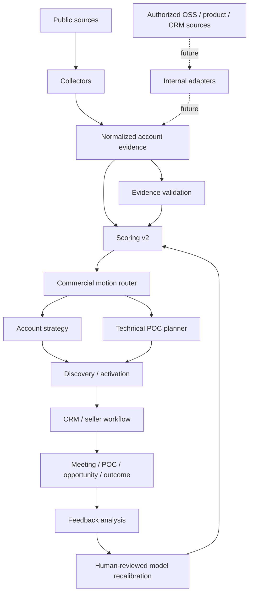

# System Architecture

## Purpose

The system is an **outside-in commercial intelligence layer** for technical GTM research. It is designed around a developer-infrastructure motion where public technical evidence, open-source activity, product intent, CRM state, and POC outcomes may eventually converge—but only public evidence is used in this portfolio implementation unless explicitly marked as modeled.

The architecture prioritizes **auditability over black-box automation**.



## Core components

### 1. Public evidence collection

`app/collectors/public_web.py`

Responsibilities:

- fetch configured public pages with an explicit user agent;
- convert HTML into compact visible text;
- record retrieval timestamp and HTTP state;
- surface keyword hits without treating them as inferred intent;
- fail visibly when a source cannot be retrieved.

It does **not** crawl arbitrary sites, infer private behavior, or silently convert a keyword match into a production-usage claim.

### 2. Evidence model and quality gate

`app/intelligence/evidence.py`

Evidence is stored as either:

- `observed` — a sourced public claim;
- `hypothesis` — an interpretation requiring discovery validation.

The outreach-readiness gate requires:

- at least two observed claims;
- 100% source coverage for those observed claims;
- at least two distinct source URLs;
- no unsupported evidence types.

The gate is intentionally conservative. It represents **research readiness**, not permission to automate outreach at scale.

### 3. Multidimensional scoring v2

`app/scoring/scoring.py`

The score separates:

- technical fit;
- pain evidence;
- timing;
- intent;
- evidence quality;
- counter-signal penalties.

Counter-signals can reduce current priority while preserving technical fit. This prevents an incumbent technology from being treated as a displacement opportunity merely because it is present.

Confidence is derived from source coverage and independent corroboration, not the number of signals.

See `SCORING_MODEL_V2.md` for governance details.

### 4. Commercial motion router

`app/intelligence/opportunity_mapper.py`

Maps observed technical context into a research motion, such as:

- ClickHouse competitive evaluation;
- observability/search consolidation;
- large-scale log analytics;
- lakehouse serving acceleration;
- AI context / agent observability;
- real-time product analytics.

Routing proposes **what to investigate**, not what sales should claim is broken.

### 5. Strategy and POC planning

`app/agents/strategist.py`  
`app/intelligence/poc_planner.py`

The strategy layer produces:

- why-now evidence;
- discovery hypothesis;
- recommended technical motion;
- talk track.

The POC layer produces:

- workload hypothesis;
- representative dataset guidance;
- test plan;
- success metrics.

The design intentionally routes from account research to **technical proof**, not directly to generic outbound copy.

### 6. Commercialization model

`app/intelligence/commercialization.py`

Models how OSS/community and product signals could contribute to commercial readiness.

Public-safe examples include:

- OSS activity;
- enterprise-domain identity;
- technical fit.

Signals that require internal authorization include:

- trial started;
- meaningful data loaded;
- repeat querying;
- multi-user adoption;
- integration connection.

Those internal signals are represented in the model but are never claimed as observed VeloDB behavior in this portfolio project.

### 7. Activation boundary

`app/agents/personalization.py`

Personalization is deliberately downstream of evidence validation and strategy. The project generates an evidence-grounded opener, but the architecture assumes production activation should include:

- seller review;
- rate limits;
- suppression rules;
- consent/compliance controls;
- CRM deduplication;
- audit logging.

Those controls are architecture requirements, not falsely claimed implemented enterprise integrations.

### 8. Feedback loop

`app/intelligence/feedback_loop.py`

Models outcomes such as:

```text
no reply → reply → meeting → POC → opportunity → won / lost
```

The system can summarize signal performance, but it **does not automatically rewrite scoring weights**.

Production recalibration should require:

- sufficient sample size;
- stable outcome definitions;
- holdout/control evaluation;
- false-positive analysis;
- seller feedback;
- human approval;
- a new documented scoring version.

## Data contract

A production event should preserve at least:

```text
account_id
source_type
source_url
retrieved_at
observed_or_hypothesis
signal_key
entity_resolution_confidence
scoring_version
activation_decision
seller_action
commercial_outcome
```

This provides lineage from public/internal evidence through routing and eventual outcome analysis.

## Failure modes and safeguards

| Failure mode | Safeguard |
|---|---|
| technology detected → assumed pain | observed/hypothesis split + counter-signals |
| many weak signals → false confidence | confidence based on provenance, not count |
| duplicate evidence | source-diversity diagnostics |
| stale/broken sources | weekly source smoke workflow |
| incumbent success ignored | explicit counter-signal penalties |
| benchmark cherry-picking | disclosed fair-benchmark protocol |
| model drift | scoring versioning + human-reviewed recalibration |
| private-data implication | explicit public/internal boundary throughout repo |
| automated outreach overreach | activation treated as downstream governed layer |

## Apache Doris workload harness

`benchmark/doris/`

The harness demonstrates how technical GTM research can turn into a reproducible POC artifact. It includes:

- deterministic synthetic agent-observability data;
- Doris schema;
- representative queries;
- Stream Load procedure;
- fair benchmark disclosure requirements.

No latency or throughput result is claimed until it is actually measured on disclosed infrastructure.

## Internal VeloDB extension points

With explicit authorization, adapters could be added for:

```text
Apache Doris community activity
          +
VeloDB Cloud trial/product events
          +
CRM / seller activity
          +
partner/co-sell context
          +
POC results
          +
win/loss outcomes
```

The result would be a governed open-source-to-enterprise revenue intelligence layer rather than a public-data research prototype.

## Why deterministic first

Core routing and scoring are deterministic because GTM systems benefit from:

- reproducibility;
- auditability;
- transparent tradeoffs;
- easier experimentation;
- safer production controls;
- clear attribution.

LLMs are most useful around the deterministic core for extraction, summarization, contradiction detection, research synthesis, and message drafting—not as an uninspectable replacement for the business rules themselves.
